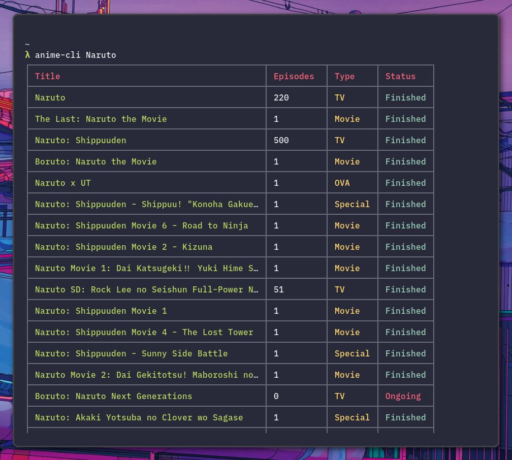

<div align="center">
  <h1>anime-cli</h1>
 </div>
 



 
 ## What its about ##
 
 The anime-cli is a commandline app created using javascript modules and an external api which can be found [here](https://jikan.moe/).
 The anime-cli app gives you information about the number of episodes of the anime, if its completed or not and tells you all its movies.
 You can also visit the npm site for this cli app [here](https://www.npmjs.com/package/@genzyy/anime-cli).
 
 
 ## How to install the commandline app ##
 As the app is a npm package you first need to install [NodeJS](https://nodejs.org/en/) and [NPM](https://www.npmjs.com/get-npm) as these are the requirements for this app.
 Now since to make this an app or to be more clear, to be able to run this app from any directory iin the terminal/cmd, you need to install this npm package globally.
 To install a npm package globally you need to have root priviledges and include global flag during the installation of any npm package.
To install this commandline app:
<br>
If you are using mac or linux:
```bash
  sudo npm install -g @genzyy/anime-cli
```
Or if you are using windows:
```bash
  npm install -g @genzyy/anime-cli
```

## Change Log ##

### v1.3.2 ###

* Thanks to [@KennyTheBard]() for adding the following features.
* You can choose if the fetched titles will have displayed score, for this run `anime-cli showScore true` or to unset it run `anime-cli showScore false`.
* You can choose if the fetched titles will have displayed year, for this run `anime-cli showYear true` or to unset it run `anime-cli showYear false`.
* You can sort ascendent or descendent on a (single) field, for this run `anime-cli <search-term> --asc Score` or `anime-cli <search-term> --desc Score`

### v1.3.1 ###

* Thanks to [@atul-g](https://github.com/atul-g) for creating a much better help section and adding a version check command.
* Added a config file which is used for setting limit for the results and to show only the matched results.
* The config file in Linux/MacOS gets stored at `~/.config/configstore/@genzyy/anime-cli.json` and generally gets stored at `$CONFIG/package-name/config.json`.
* An example config would be like 
```json
  {
	"setLimit": false,
	"limit": 10,
	"onlyMatches": false
}
```
* To set a limit on the data fetched run `anime-cli setLimit true <number-results-to-show>`.
* To unset the limit run `anime-cli setLimit false`.
* You can also fetch only the titles which match to your query, for this run `anime-cli onlyMatches true` or to unset it run `anime-cli onlyMatches false`.
* Also instead of running these commands, you can manually edit the config file and change accordingly.

 

### v1.1.2 ###
* Fixed a bug where it threw an error when only `anime-cli` was run.

### v1.1.1 ###

With the help from:
* [@MichalNemecek](https://github.com/MichalNemecek)

 Added a feature to search anime even in lowercase when passed in the arguments.

### v1.0.2 ###

Thanks to:
* [@Gamecube762](https://github.com/Gamecube762)

For adding 'type' section for a better sorting of movies and TV shows.

## Usage ##

Now that you have installed the app, you can run anime-cli in your terminal or cmd and it will show you recent animes and their episodes and airing status.
To get data about a specific anime or about its seasons and movies, run:
```bash
  anime-cli <anime-name>
```
For example:
```bash
  anime-cli Naruto
```

The keyword that you have used to search about the anime, if that keyword matches to any title in the result array them that anime will be highlighted in green color so that it shows that this anime is probably connected to the anime keyword that you have used to search about.

### Some Useful Notes ###
The cli app is currently in development and is only mantained by [me](https://github.com/genzyy) and so the development will be a little slow as I have to do my college work also.
Sorry for that!
But dont worry, I will keep adding new features and argument passing features for a more accurate data fetching.
Also, I request you while using the cli app try to pass the exact name of the anime for example pass `Boku No Hero` instead of `boku no hero` so as to get the highlighting of the animes which contain the exact names that you have passed in the arguments.
